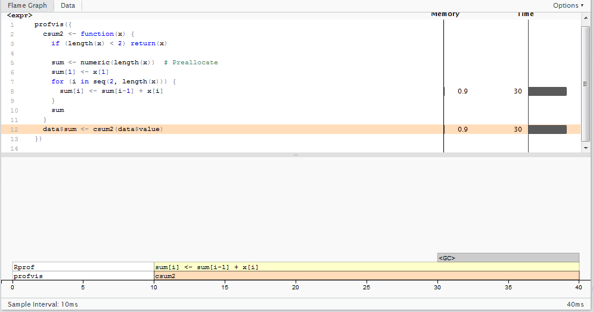

# **How to Speed Up & Improve Your Code**
## **Introduction**
### **Overview**
You might be asking yourself if your codes works why would I want to improve it? This is a good question and the simple answer is that in many cases there is probably no reason to spend any time improving your code. If the code/analysis does what you need using the available resources, and in a time you are happy with then it is not going to be worth spending time and effort improving or optimising the code. There will however be occasions where you have a code or analysis that has issues, such as it takes too long or is failing due to running out of memory, that could need or benefit from improvement and/or optimisation.

In addition to situations where improvements or optimisation are required to run a piece of code or analysis having a good understanding of how to write efficient code and  will improve the quality of the code you write, make you more efficient, and reduce the likelihood of situations where you are unable to run the code you want to.

### **Where to Start**
Once you have decided that there might be a benefit to trying to optimise your code, how do you start? A popular way of looking for places to optimise, particularly when dealing with slow code, is to profile, or benchmark, the code. Profiling/benchmarking effectively times your code and can identify functions/sections of code that are responsible for large proportions of the overall execution time and/or that are run multiple times. These sections of code offer the biggest potentially from improvements/optimisation. Profiling and benchmarking are helpful tools to find places to focus the optimisation, and are therefore covered later in this tutorial, but optimisation using them still requires an understanding of possible bottlenecks and knowledge of these types of issues can help you optimise your code even in the absence of profiling/benchmarking.

When looking at code that you want to optimise/improve it is worth bearing in mind common bottlenecks/inefficient coding practices. Some of the most common bottlenecks/inefficiencies are:

* **Inappropriate object types** - R has a number of different object and/or data types. In many cases there are multiple ways the same data could be stored and it may be surprising to know that the choice of object and/or data structure can have dramatic impact upon the performance and efficiency of your code.
* **Growing data** - this term refers to adding values incrementally to vectors, matrices or data frames. It is often encountered in loops where it is used to collated and store results/output created during the loop. Growing objects inefficient as it is slow and has memory intensive. It is much more efficient to preallocate to the full size and sequentially fill in the values as created.
* **Looping rather than Vectorising** - Languages such as R are vectorised (e.g. optimised to work on vectors of data at once)  and in such languages using loops can be relatively inefficient.
* **Nonessential objects** - avoid creating and storing unnecessary R objects, for example creating multiple copies of the same object or subsets of other objects
* **Nonessential operations** - try and avoid or eliminate the unnecessary functions call, printing statements, etc..
* **Memoization** - it may seem to contradict the point above but it can be efficient to store the results of function calls rather than using the function output directly if the output is need more than once, particularly where the call is time/resource heavy.
* **function options/overheads** - Many functions that are part of the base R package or in additional packages can have options that alter the performance/efficiency of the function. It can be worth looking through the help file for these functions to look for such options (or alternative functions).

In the following sections we will cover some of these common bottlenecks/inefficiencies in more detail.

## **Comon Bottlenecks or Inefficiences**

### **Inappropriate Object Types**
There are many different data structures in R and they each serve different purposes. Choosing the right object type for your needs, or alternatively using the wrong type, can have a noticeable effect on your code.

#### **Factors versus Character/Numeric**
On the face of it factor objects/data in R appear very similar to the standard numerical or character data objects and in many cases code will work the same using either. However there are differences between factors and the standard character/numeric data objects that can cause code to behave in an unexpected ways if you are not aware of the distinction under certain circumstance.

Factor objects/data types are designed to deal with categorical data, i.e. data where you have a limited/finite number of possible values, or categories, that is typically much smaller than the actual number of items being stored, with one or more values being repeated multiple times in the data. The values in a factor  can be either numerical or characters and therefore factors can be used to store data that could alternatively stored in standard numerical or character data objects/types. The benefit of using a factor to store categorical data are that:

1. R knows that the object is categorical and functions can deal with it appropriately (e.g. in statistical model functions, such as `lm()`, `glm()`)
2. Factor objects in R seperates the storage of the actual values (or levels as they are known in R) from their occurrence in the dataset

The second of these benefits can have a dramatic effect the memory requirements to store data particularly where the relatively few unique values and the values are character strings. This is because internally R actually stores the categorical data as a short vector containing the distinct values (levels) that are present in the data and an associated numerical vector of the same length as the original data containing integers that linking the elements of the factor to values in the level vector, e.g. a value of 1 in the numerical vector means that the element contained the 1^st^ value in the vector of distinct values.

The following examples investigate the structure of factor objects along with the benefits and potential problems associated with this structure.

```{r}
# Create an object containing vector of on the type of pet people have
pets <- c("cat","cat","dog","cat","rabbit","dog","dog","hamster","dog")
# Convert this object to a factor
pets_cat <- factor(pets)
# Show the factor
pets_cat
```
In the output above you can see when asked to show the value of the factor object R shows the categorical data as expected but below the data has a line showing the levels in the factor. In order to see how the data is actually being stored we need to use some other functions

```{r}
str(pets_cat)
```
The `str()` function shows the structure of the object which in this case shows that the `pets_cat` object is a factor with 4 levels, shows us the first 3 levels ("cat","dog","hamster"), shows that there are more levels which are shown ("...") and shows the start of the data held object after the colon (e.g. 1, 1, 2, 1, 4, etc.).  Similarly if we use the `unclass()` function we can also see the 2 components that make up the factor object; the numerical vector and the vector of distinct values, the latter of which we can now see is stored as a attribute of with the numerical vector.

```{r}
unclass(pets_cat)
```

Given that the actual values in a factor are only stored once each and a numerical vector used to link elements in the original data to the values a factor can be notably more efficient in terms of memory/space than the same data stored as character.

```{r tidy = TRUE}
# Create a vector of the months of the year which we will use to create a long vector of characters values
	mnths <- c("January", "February", "March", "April", "May", "June", "July", "August", "September", "October", "November", "December")
# Create a vector of 10000 values sampling from the mnths vector with replacement
	set.seed(42) # Set the seed so everyone should get the same sample
	test_chr <- sample(mnths,10000,replace = TRUE)
# Convert this 10000 element character to factor
	test_fac <- factor(test_chr)
# Now compare the sizes (using object.size() function)
	paste("Character vector size =",format(object.size(test_chr),units = "auto"))
	paste("Factor vector size =",format(object.size(test_fac),units = "auto"))
```

This shows that factor object is approximately half the size (in terms of memory requirements) of the same data stored as a character vector.

The fact that a factor object is actually internally stored as a numerical vector, with a associated vector of values, can however sometimes cause issues with your code as sometimes functions will get the values from the factor while others will get the raw integer vector. For example if you use the `paste()` function versus the `cat()` function to print `pet_cats` to the screen you get different results.

```{r}
paste(pets_cat)
cat(pets_cat)
```


##### *Exercises*

1. Can you explain why the factor version `test_fac` takes up less space than the character version `test_chr` despite them containing the same data?
2. Under what circumstances would you expect the difference between the two versions to be at its most extreme?
	+ Write R code to test/demonstrate this.
3. Would a factor be more memory efficient that a numerical vector when required to store 10,000 random values between 1:100
	+ Write R code to test/demonstrate this.
4. Using factors rather than characters can be more complex due to the additional complexity/constraints involed with factor objects
  + The order of levels in a factor can often be important
    + What is the default order for levels in a factor in R?
	  + can you recreate `test_fac` so that the ordering of the levels the order they come in the year?
	+ Another difference that can cause problems when using factors is trying to add or remove data to the factor can be as issue as it can leave behind levels with no data (sometimes this is beneificial) or it can prevent the additon of data that contains values not in the current levels.
	  + Create a modified version the `pets_cat` object which excludes the "hamster" entry (the 8^th^ element), is the hamster still a level in the vector?
	  + Can you modify the vector you just created so that "hamster" is no longer a level in the factor
	  
5. Can you modify the existing version of `test_fac` so that categories are 3 letter abbreviations of each month rather than the full title without re-sampling the data?
	
	
#### **Matrix versus Data Frame**
When you first start using R there may not seem to be much difference between the matrix and data frame object types. They both looking similar, essentially being tables of data but there are a number of important differences that distinguish between these data types. One of the most important differences is that a matrix, can only contain data of one type (i.e. character, numeric, factor, etc). This is because a matrix is a vector structured into 2 dimensions via a `nrows` and `ncols` attributes. In contrast a data.frame object can contain data of multiple types, with the limitations that the data within each column are only of one data type but that the types of data in each column can vary. The data.frame object in R is actually a specialised case of `list` object in which the columns are the elements in the list and where all of these elements have the same length.

As a data.frame can store the data in a similar format to a matrix but are also more flexible in the data they can contain you wonder why you would want to use a matrix. The following simple example will highlight some of the difference between matrix and data.frame objects and hopefully give insight into when you might want to think about using a matrix and how doing so can help optimise your code

In the example below we will create a dataset of 10,000 values to represent 1000 measurements/samples made at 10 different sites. We will use the example to investigate the differences between matrices and data.frames.
```{r}
# Set the seed so everyone should get the same numbers (not really necessary)
set.seed(42)
# Create the matrix of 10,000 values
test_mat <- matrix(rnorm(10*1000,50,10), ncol = 10, nrow = 1000, 
							dimnames = list(
														paste("Samp",1:1000,sep="_"), 
														paste("Site",1:10,sep="_")
													)
						)
# Create a copy of the data in the test_mat stored as a data.frame 
test_df <- as.data.frame(test_mat)
# Show the head of the test_mat object
head(test_mat)
```


##### *Exercises*

1. Compare the memory used to hold these two objects in the workspace, which is larger?
	+ can you think of posible  reasons for this?
2. There are several ways to calculate the sum and/or mean of values in row and/or columns of data in tabular objects such as data.frames or matrices e.g. apply based options such as`apply`,`lapply`, or build in functions such as `rowSums()` & `colSums()`, `.colSums()` & `.rowSums()`,`rowMeans()` & `colMeans()`
	+ do you think these will differ in their performance when fitted to the same data?
	+ are their relative performances affected by the class of object to which they are applied?
	+ write R code to test whethere the performance differs between the functions/ways and also when supplied with different classes of data
	+ why do you think the performance is affected by the class of the object
3. What is the classes of a single row from each of these objects, are they different if so why? Does the same apply to single columns from each of these objects
4. Extract the column names as a vector from each of these objects
5. Does extracting a column from the objects using object_name$column_name format work with both objects?
6. Given your findings from above is there a method you could use to extract a specified column of data using the column name that would work for both objects?
	+ Is there any difference between the vectors returned?
7. Try benchmarking code to calculate the standard deviation for each column of the two data objects. Are they the same, if not can you think of anything that may speed it up for the slower object?


### **Growing objects**
Growing an object is where concatenation functions (such as c, rbind, cbind) are used to add one set of data to an existing set of data. The most common place where objects are grown is during loops where the results and/or data from the current iteration are added to objectss that hold the results from the previous iterations. Where this occurs only a few times this isn't really much of a problem but in cases where the data being added in every iteration is relatively large and/or where the number of iterations is large this can have pronounced performance implications both on memory usage (via temporary duplication and also memory fragmentation) and code speed. There are several alternatives to growing objects the most common is to create an object that is the correct size to store all the data that will be produced and then to insert the data into the object as it is created. An alternative is to save the results to a file(s), which can be combined in a single operation later.

This simple example, in which a sequence from 1:10,000 is created in 3 different, ways should illustrate the impact on speed that growing an object can have on your code.

```{r warning=FALSE}
# Load microbenchmark library if not already loaded
library(microbenchmark)
# Method 1 - create the vector via a loop by growing
method1 = function(n) {
vec <- NULL
for(i in seq_len(n))
  vec <- c(vec, i)
  vec
}
# Method 2 - create a sequence via a loop by creating a vector of the final size
# and then fill it in
method2 = function(n) {
  vec <- numeric(n)
  for(i in seq_len(n))
  vec[i] <- i
  vec
}

# Method 3 - create the sequence using a built-in function
method3 = function(n) seq_len(n)

n = 10000
microbenchmark(method1(n), method2(n), method3(n))
```
This example hightlights that growing the object within a loop is much slower than creating an object of the correct dimensions at the start and then inserting the results into this object as they are obtained.


##### *Exercises*

The following exercises are based upon using code to create a 3 column data.frame containing simulated count data for a number of sites and years. The intial code below used a loop to produce the data for each year independatly binding the to the data generated for previous years.


```{r}
method1 = function(n_yr, n_sites = 10){
  set.seed(42)  # Set the seed so the results should be the same
  res <- NULL
  for(i in seq_len(n_yr)){
    res <- rbind(res, data.frame(YEAR = i, 
            SITE = seq_len(n_sites), 
            COUNT = rpois(n_sites,sample(1:100,size = 1))) 
          ) 
  }
  return(res)
}

# Now run this function to generate 100 years of data
x1 = method1(100)
head(x1)
```
1. Create a modified version of the function detailed above (giving it a different name so you don't overwrite this one) that inserts the results into a res object of a size required to take all the data prior to the loop and then inserts the results into this object as they are produced by the loop.
2. Benchmark your function against the function detailed above, is yours faster, does it store the results correctly? Does your functions still work correctly if you call the function by supply a value of 15 to the n_sites argument, overriding the default of 10? 
3. Below is an altered version of method 1 in which the number of sites each year varies randomly between 1 and n_sites. Create a new version of this function that returns the results from all the loops in a single object without growing the object?
```{r}
Method3 = function(n_yr, n_sites = 10){
  set.seed(42)  # Set the seed so the results should be the same
  res <- NULL
  for(i in seq_len(n_yr)){
    cur_sites <- sample(1:n_sites,1)
    res <- rbind(res, data.frame(YEAR = i, 
              SITE = seq_len(cur_sites), 
              COUNT = rpois(cur_sites,sample(1:100,size = 1))) 
          ) 
  }
  return(res)
}
```

4. Can you think of any other alternative ways to do exercise 3 i.e. create an adapted version of the Method 3 function, that stores the results from the loop without growing an object (if so can you create it or if not can you describe how to do it)?


### **Vectorising Code**
Vectorised code is where an operation is applied to all the elements in an object without using loops. It is often desirable to vectorise code in R as loop written in R tend to be relatively slow. In the example we attempt to illustrate this by vectorising a function that takes a series of x,y coordinates and then add these points to a plot as squares of a given dimension.


A simple demonstration of vectorised code is the performing simply mathematical operations, such as addition, on 2 vectors of the same length. If we have two vectors `x` and `y` for which we want the pairwise sums of each vector, e.g. element 1 of `x` + element 1 of `y`, element 2 of `x` + element 2 of `y`, etc.  
```{r}
x <- 1:100
y <- 1:100
```

In many programming languages, such a C, this type of operation would required use of a loop to go through each element of the vectors and calculate and store the individual sums.
```{r}
# Create object to hold pariwise sums
pair_sums <- rep(NA, length(x))
# Loop through each elemnent and perform multiplication
for(i in 1:length(x)){
  pair_sums[i] <- x[i] + y[i]
}
head(pair_sums)
```
R on the other hand supports vectorised code so this step is not necessary and we can instead calculate all pairwise sums in one go.
```{r}
# Calculate the pairwise sums in a vectorised manor
pair_sums2 <- x + y
head(pair_sums2)
# Check that the objects are teh same
identical(pair_sums, pair_sums2)
```


##### *Exercises*

We have a series of x,y coordinates in a data.frame that representing the centre points of a series of squares.
```{r}
set.seed(42)
n <- 200
test <- data.frame(
					x = sample(1:100,n, replace = TRUE), 
					y = sample(1:100,n, replace = TRUE)
				)
```

If we wanted to plot these squares we can write a function that takes these x,y coordinates as a input and then loops over the x,y values calculating the x,y coordinates for the corner points of each square and then adding that square to the plot using the polygon function.
```{r}
sq_corner <- function(x,y, width = 1){
  # Calculate the horizontal/vertical distance from the centre to the edge lines
  sq_dist <- width / 2
  for(i in seq_along(x)){
    # Calculate the x values of the 4 corner points (bl,tl, tr, br)
    x_corn <- rep(c(x[i] - sq_dist, x[i] + sq_dist),each = 2)
    # Calculate the y values of the 4 corner points
    y_corn <- c(y[i] - sq_dist, y[i] + sq_dist, y[i] + sq_dist, y[i] - sq_dist)
    # Create data.frame to be used to plot polygon
    cnrs <- data.frame(x = x_corn, y = y_corn)
    # Add square to plot
            polygon(cnrs, border = "blue")
    }
}
```

We can then use this function to produce the plot
```{r, fig.width=7, fig.height=7}
# Setup the plot to plot the centres but don't plot the symbols
  plot(test,xlim = c(-1,101), ylim = c(-1,101), type="n", asp = 1)
# Add the squares using the function
  sq_corner(test$x, test$y)
```
1. Can you vectorise the sq_corner function so that it works without requiring a loop?

### **Profiling & Benchmarking**
In a couple of the previous examples we have have used functions to benchmark a function, e.g. determine the time taken for the function to run. This can be as simple as using `Sys.time()` at the start and end of the function to store the start and end time of the funciton and then calculating the difference to get the run time, or it can involve specific benchmarking function such as `microbenchmark()` in the `microbenchmark` package. Benchmarking allows different sections of code to be compared to help optimise your code. Benchmarking can tell you how long a section of code takes to run or it can be used compare multiple versions/sections of code to determine which is the most efficient but it doesn't really help in narrowing down or targeting what the slow points in your code are. This is where profiling your code using a profiling package, such as `profvis`, can be extremely useful particularly if you use RStudio as profvis support is included. The `profvis` package provide a user friendly way to profile your code, enabling you to identify code that is responsible for a large proportion of the run-time and/or that are being run multiple times during program execution.

The following example is taken from a useful tutorial on the RStudio website about [Profiling with RStudio](https://support.rstudio.com/hc/en-us/articles/218221837-Profiling-with-RStudio).

#### **Profiling Time**

In this example, we'll work with a data frame that has 151 columns. One of the columns contains an ID, and the other 150 columns contain numeric values. What we will do is, for each numeric column, take the mean and subtract it from the column, so that the new mean value of the column is zero.

```{r warning= FALSE}
# Load profvis package
	library(profvis)
```


```{r}
# Create data frame that has 151 columns 
	times <- 4e5
	cols <- 150
	data <-
	as.data.frame(x = matrix(rnorm(times * cols, mean = 5),
	ncol = cols))
	data <- cbind(id = paste0("g", seq_len(times)), data)

	# Now profile code to take this data.frame and 
	# normalise each column (i.e. substract by the column mean)
	profvis({
		# Store in another variable for this run
		data1 <- data

		# Get column means
		means <- apply(data1[, names(data1) != "id"], 2, mean)

		# Subtract mean from each column
		for (i in seq_along(means)) {
		data1[, names(data1) != "id"][, i] <-
		data1[, names(data1) != "id"][, i] - means[i]
		}
	})
```

The image below shows a screenshot of the profile returned for the above block of code.


Most of the time is spent in the apply call, so that's the best candidate for a first pass at optimization. apply calls as.matrix and aperm. These two functions convert the data frame to a matrix and transpose it - so even before we've done any useful computations, we've spent a large amount of time transforming the data.

We could try to speed this up in a number of ways. One possibility is that we could simply leave the data in matrix form (instead of putting it in a data frame in line 4). That would remove the need for the as.matrix call, but it would still require aperm to transpose the data. It would also lose the connection of each row to the id column, which is undesirable. In any case, using apply over columns looks like it will be expensive because of the call to aperm.

An obvious alternative is to use the colMeans function. But there's also another possibility. Data frames are implemented as lists of vectors, where each column is one vector, so we could use lapply or vapply to apply the mean function over each column. Let's compare the speed of these four different ways of getting column means.

```{r eval = FALSE}
profvis({
		data1 <- data
		# Four different ways of getting column means
		means <- apply(data1[, names(data1) != "id"], 2, mean)
		means <- colMeans(data1[, names(data1) != "id"])
		means <- lapply(data1[, names(data1) != "id"], mean)
		means <- vapply(data1[, names(data1) != "id"], mean, numeric(1))
	})
```


`colMeans` is about 6x faster than using `apply` with `mean`, but it looks like it's still using `as.matrix`, which takes a significant amount of time.`lapply`/`vapply` are faster yet - about 10x faster than `apply`. `lapply` returns the values in a list, while vapply returns the values in a numeric vector, which is the form that we want, so it looks like vapply is the way to go for this part.

Let's take the original code and replace `apply` with `vapply`

```{r eval = FALSE}
profvis({
  data1 <- data
  means <- vapply(data1[, names(data1) != "id"], mean, numeric(1))

  for (i in seq_along(means)) {
    data1[, names(data1) != "id"][, i] <- data1[, names(data1) != "id"][, i] - means[i]
  }
})
```


Our code is about 3x faster than the original version. Most of the time is now spent on line 6, and the majority of that is in the `[<-` function. This is usually called with syntax `x[i, j] <- y`, which is equivalent to `[<-(x, i, j, y)`. In addition to being slow, the code is ugly: on each side of the assignment operator we're indexing into data1 twice with [.

In this case, it's useful to take a step back and think about the broader problem. We want to normalize each column. Couldn't we we apply a function over the columns that does both steps, taking the mean and subtracting it? Because a data frame is a list, and we want to assign a list of values into the data frame, we'll need to use lapply.

```{r eval = FALSE}
profvis({
		data1 <- data

		# Given a column, normalize values and return them
		col_norm <- function(col) {
		col - mean(col)
		} 

		# Apply the normalizer function over all columns except id
		data1[, names(data1) != "id"] <-
		lapply(data1[, names(data1) != "id"], col_norm)
	})
```


Now we have code that's not only about 8x faster than our original - it's shorter and more elegant as well. Not bad! The profiler data helped us to identify performance bottlenecks, and understanding of the underlying data structures allowed us to approach the problem in a more efficient way.

Could we further optimize the code? It seems unlikely, given that all the time is spent in functions that are implemented in C (mean and -). That doesn't necessarily mean that there's no room for improvement, but this is a good place to move on to the next example.

#### **Profiling Memory**
This example addresses some more advanced issues. This time, it will be hard to directly see the causes of slowness, but we will be able to see some of their side-effects, most notably the side-effects from large amounts of memory allocation.

Suppose you have a data frame that contains a column for which you'd like to take a cumulative sum (and you don't know about R's built-in cumsumfunction). Here's one way to do it:

```{r eval = FALSE}
profvis({
  data <- data.frame(value = runif(3e4))

  data$sum[1] <- data$value[1]
  for (i in seq(2, nrow(data))) {
    data$sum[i] <- data$sum[i-1] + data$value[i]
  }
})
```


This takes over 2 seconds to calculate the cumulative sum of 30,000 items. That's pretty slow for a computer program. Looking at the `profvis` visualization, we can see a number of notable features:

Almost all the time is spent in one line of code, line 6. Although this is just one line of code, many different functions that are called on that line.

In the flame graph, you'll see that some of the flame graph blocks have the label `$`, which means that those samples were spent in the `$` function for indexing into an object (in R, the expression `x$y` is equivalent to `$(x, "y")`).

Because `$` is a generic function, it calls the corresponding method for the object, in this case `$.data.frame`. This function in turn calls `[[`, which calls `[[.data.frame`. (Zoom in to see this more clearly.)

Other flame graph cells have the label `$<-`. The usual syntax for calling this function is `x$y <- z`; this is equivalent to `$<-(x, "y", z)`. (Assignment with indexing, as in `x$y[i] <- z` is actually a bit more complicated.)

Finally, many of the flame graph cells contain the entire expression from line 6. This can mean one of two things:

1. R is currently evaluating the expression but is not inside another function call.
2. R is in another function, but that function does not show up on the stack. (A number of R's internal functions do not show up in the profiling data. See more about this in the FAQ.)

This profiling data tells us that much of the time is spent in `$` and `$<-`. Maybe avoiding these functions entirely will speed things up. To do that, instead of operating on data frame columns, we can operate on temporary vectors. As it turns out, writing a function that takes a vector as input and returns a vector as output is not only convenient; it provides a natural way of creating temporary variables so that we can avoid calling `$` and `$<-` in a loop.

```{r eval = FALSE}
profvis({
  csum <- function(x) {
    if (length(x) < 2) return(x)

    sum <- x[1]
    for (i in seq(2, length(x))) {
      sum[i] <- sum[i-1] + x[i]
    }
    sum
  }
  data$sum <- csum(data$value)
})
```


Using this csum function, it takes just over half a second, which is about 4x as fast as before.

It may appear that no functions are called from line 7, but that's not quite true: that line also calls `[`, `[<-`, `-`, and `+`.

* The `[` and `[<-` functions don't appear in the flame graph. They are internal R functions which contain C code to handle indexing into atomic vectors, and are not dispatched to methods. (Contrast this with the first version of the code, where `$` was dispatched to `$.data.frame`).
* The `-` and `+` functions can show up in a flame graph, but they are very fast so the sampling profiler may or may not happen to take a sample when they're on the call stack.

You probably have noticed the gray blocks labeled `<GC>`. These represent times where R is doing garbage collection - that is, when it is freeing chunks of memory that were allocated but no longer needed. If R is spending a lot of time freeing memory, that suggests that R is also spending a lot of time allocating memory. This is another common source of slowness in R code.

In the csum function, `sum` starts as a length-1 vector, and then grows, in a loop, to be the same length as `x`. Every time a vector grows, R allocates a new block of memory for the new, larger vector, and then copies the contents over. The memory allocated for the old vector is no longer needed, and will later be garbage collected.

To avoid all that memory allocation, copying, and garbage collection, we can pre-allocate a correctly-sized vector for sum. For this data, that will result in 29,999 fewer allocations, copies, and deallocations.

```{r eval = FALSE}
profvis({
  csum2 <- function(x) {
    if (length(x) < 2) return(x)

    sum <- numeric(length(x))  # Preallocate
    sum[1] <- x[1]
    for (i in seq(2, length(x))) {
      sum[i] <- sum[i-1] + x[i]
    }
    sum
  }
  data$sum <- csum2(data$value)
})
```



This version of the code, with `csum2`, is around 60x faster than our original code. These performance improvements were possible by avoiding calls to `$` and `$<-`, and by avoiding unnecessary memory allocation and copying from growing a vector in a loop.

#### *Exercises*
1. Try profiling some of the other examples in this tutorial to determine how the changes you made during the section/exercises has improved the efficiency of the code in terms of both time and memory usage?

### **Parallelisation**

Parallelisation is where you use multiple processors to work simultaneously on different parts of a problem. In the follow example we are going to revisit a function that we were working on in the growing objects section.

```{r}
    method4 = function(n_yr, n_sites = 10){
      set.seed(42)  # Set the seed so the results should be the same
      res <- data.frame(YEAR = numeric(n_yr*n_sites), SITE = 0, COUNT = 0)
      cur_pos = 1
      for(i in seq_len(n_yr)){
        cur_sites <- sample(1:n_sites,1)
        temp <- data.frame(YEAR = i, 
                    SITE = seq_len(cur_sites), 
                    COUNT = rpois(cur_sites,sample(1:100,size = 1))
                )
        res[seq(from=cur_pos,by = 1, length.out = nrow(temp)),] = temp
        cur_pos <- cur_pos + nrow(temp)
      }
      res[which(res$YEAR != 0),]
    }

```

In this example we will use this function to produce 100 datasets, 10 of which contain 10 years of counts, 10 with 20 years of counts, 10 with 30 years of counts and so on till 10 with 100 years of counts. We will use `lapply()` and a parallel version of lapply from the `parallel` package (`parLapplyLB`) to compare using this code normal versus in parallel. It should be noted that the performance boost for the parallel version will be relatively small due to the limited number of processing cores available on a standard laptops/desktop.

Ideally your computer would have at least 4 processing cores, allowing us to assign 3 cores to the task and 1 remaining to continue running everything else on your computer (i.e. OS,  R, etc). However, many of you may have computers with only 2 processing cores, particularly if you are using an older computer or laptop, in which case this example may struggle as running tasks in parallel will compete with the running of the operating system & programs. Generally if you are interested in running code in parallel you probably have access to a more powerful computer with 4 cores or more and/or access to a high performance computing cluster which can have hundreds of cores at your disposal.

To run code in parallel you first need to set up a cluster of processors that will be used to do your operations. In the parallel package this is done by using the makeCluster function. One of the arguments passed to the makeCluster function is the number of cores you want to allocate to the cluster. As mentioned above when running code on your own computer you probably want to limit the number of cores allocated to be at most 1 less than the total number of cores in your computer. The `detectCores` function will attempt to determine and return the number of cores available in your computer.

```{r}
  # First we need to load the parallel library
    library(parallel)
  # Now we can use the function to detect the number of cores
    cores <- detectCores(logical = FALSE)
    cores
```
We can now create the cluster we will use.
```{r}
cl <- makeCluster(cores-1)
```

In order to use lapply (or the parallel version) we need to set up a list or vector that the lapply function "loop" over sending the current value to the function specified. In our example we need a vector giving the number of years of data to be created in each iteration.

```{r}
nyear <- rep(seq(from = 10, to = 100, by = 10), each = 10)
nyear
```

We can then use the lapply function on this vector to apply the `method4` function to each element in the vector, in a non-parallel manor.

```{r}
non_par_res <- lapply(nyear, FUN = method4)
```

To do the same in parallel we simply exchange the lapply function for the parallel version parLapplyLB in the parallel package.

```{r}
par_res <- parLapplyLB(cl = cl, X = nyear, fun = method4)
```

#### *Exercises*

1. Do the two approaches given above return then same results?
2. Benchmark these two approaches, is the parallel version faster?
	+ if so how much faster, and is this what you expected?
3. Try the following command `detectCores(logical = TRUE)`, does the value returned differ from the command you used previously `detectCores(logical = FALSE)`?
	+ if so do you know why?
4. Both `lapply` and the parallel equivalent `parLapplyLB` return a list, however in many cases this list will contain a series of smaller sub-units (in this case data frames) each as a seperate unit of the list. Ideally you probably want the output as a single data.frame, write code to take the output in `non_par_res` and/or `par_res` and combine them to form a single data.frame for each approach (e.g. one data frame for the output from the non-parallel approach and another data frame for the output from the parallel approach).
5. What term does the LB at the end of the `parLapplyLB` function name refer to?
	+ What does this term mean in regards to parallel processing?


*** 
 
## **Answers**
### **Inappropriate Object Types**
#### **Factors versus Character/Numeric**
1 `test_fac` takes up less space than `test_chr` because the memory required to store a single integer for each element is less than the memory required to shore each of the characters that make up the character string values in each element of `test_chr`.

2 Although the change is relatively minor the difference in size between the factor and character vectors will be increased when there are a large number of elements in the vector, when the values are longer characters strings, and when the fewer distinct values present in the dataset.

```{r}
cat_values <- c(
									"People that like Marmite",
									"People that hate Marmite", 
									"People that really don't know what they like"
							)
marm_surv_chr <- sample(cat_values,1000000,replace = TRUE)
marm_surv_fac <- factor(marm_surv_chr)
paste("Character vector size =", format(object.size(marm_surv_chr), units = "auto"))
paste("Factor vector size =", format(object.size(marm_surv_fac), units = "auto"))

```
```{r,echo = FALSE}
rm(cat_values, marm_surv_chr, marm_surv_fac)
```
3 As a factor converts the values to a integer vector the difference between a numerical vector and a factor should not be the same as observed with the character vector.

```{r}
num_vec <- sample(1:100, 10000, replace = TRUE)
num_fac = factor(num_vec)
paste("Numerical vector size =", format(object.size(num_vec), units = "auto"))
paste("Factor vector size =", format(object.size(num_fac), units = "auto"))

```
In fact given that the factor stores the a vector of integer values but has to additionally include a vector of levels then the factor is actually larger than the numerical vector.

4 The default ordering of the levels in a factor is to sort the levels alphabetically
```{r}
levels(test_fac)
```
When creating a factor it is possible to set an alternative ordering for the levels, the following code shows how to re-create the `test_fec` object from `test_chr` but this time control the ordering of the levels so that they are ordering in the correct order
```{r}
test_fac <- factor(test_chr, levels = mnths)
levels(test_fac)
```
Creating a version of the `pets_cat` factor but excluding the element containing the hamster entry (element 8)
```{r}
new_pets_cat <- pets_cat[-8]
new_pets_cat
```
The hamster level is still present as a level in the factor despite not being present in the data itself. The presence of levels in a factor that are not represented in the current data can sometimes be beneficial but can also be a problem so it is useful to know how to exclude levels that are not now present in the data. It can be done by using `factor()` to re create the factor but can also be done by using the `droplevels()` function.
```{r}
new_pets_cat = droplevels(new_pets_cat)
new_pets_cat
```


#### **Matrix versus Data Frame**
1 The data.frame object is larger
```{r}
paste("Matrix size =",format(object.size(test_mat),units = "auto"))
paste("Data Frame size =",format(object.size(test_df),units = "auto"))
```
In order to provide the additional flexiblity a data.frame object is a more complex structure and therefore has an additional overhead when compared to a matrix

2 The functions do differ in performance and their performance is affected by class of the object
```{r}
#rowSums on matrix
n_reps = 1000
start_time = Sys.time()
for(i in 1:n_reps){
	temp = rowSums(test_mat)	
}
end_time = Sys.time()
end_time - start_time

#rowSums on data.frame
n_reps = 1000
start_time = Sys.time()
for(i in 1:n_reps){
	temp = rowSums(test_df)	
}
end_time = Sys.time()
end_time - start_time

#lapply on matrix
n_reps = 1000
start_time = Sys.time()
for(i in 1:n_reps){
	temp = lapply(test_mat, FUN = sum)	
}
end_time = Sys.time()
end_time - start_time


#lapply on data.frame
n_reps = 1000
start_time = Sys.time()
for(i in 1:n_reps){
	temp = lapply(test_df, FUN = sum)	
}
end_time = Sys.time()
end_time - start_time
```

The performace of a function can often depends upon what class of data the fuction wants/expects. Typically providing data in the format the function prefers will improve performance as the function does not need to do any data conversions to handle the data.

The above code shows how a simple loop and the `Sys.time()` function can be used to provide simple benchmarking for a function. The `microbenchmark` package provide a benchmarking function `microbenchmark` the simplifies this process and also provide information on the variability in performance between runs
```{r, warning = FALSE}
library(microbenchmark)
microbenchmark(rowSums(test_mat),times = 1000)
microbenchmark(rowSums(test_df),times = 1000)
```

3
```{r}
class(test_mat[1,])
class(test_df[1,])
```
A single row from the matrix is a numeric vector while a single row from a data.frame is still a data.frame (it is now just a 1 row data.frame with the same columns as the original data.frame. A row from the matrix is be a numeric vector as every element in the matrix is the has the same data type (numeric in this case but could be character, factor, logical, etc). In contrast a data.frame can contain different types of data in each column and therefore a row must remain a data.frame.

```{r}
class(test_mat[,1])
class(test_df[,1])
```
In contrast to the rows of a data.frame the entries within a column within a data.frame are all of a single class therefore the class of the column can be the class of the data they contain.

4 If you are used to working with data.frames you may be used to using the `names()` function to get the names of the columns from a data.frame.

```{r}
# Use names function
names(test_df)
```
However if we try the same approach with the test_mat object you don't get what you might expect

```{r}
names(test_mat)
```
The names function returns `NULL` when passed a matrix object even if the rows and columns in the matrix are actually named (as is this case here, to check used `head(test_mat) to view the top 6 rows of the matrix to see the column names yourself). The row and column names in a matrix are stored under a dimnames (short for dimension names) attribute that is a list with 2 elements the first of which is the row names and the second is the column names.

```{r}
# View the structure of the test_mat object
str(test_mat)
```
To get or set the row or column names of a matrix you can use the `dimnames` function.

```{r}
dimnames(test_mat)[[2]]
```

5 Extracting a column of data using the `$` operator, e.g. `object_name$column_name` does not work on both objects.

```{r eval = FALSE}
head(test_df$Site_1)
head(test_mat$Site_1)
```
When applied to a matrix object attetmpting to the dollar sign operator results in an error. A method that would work for both data types is to use the column name (or column number) is square brackets.

```{r}
head(test_df[,"Site_1"])
head(test_mat[,"Site_1"])
```
An interesting difference that remains betwen the output is that the vector from the matrix still has has the row names associated with each element whereas those from the data.frame do not.

7 One way of calculating the standard deviation of each column in a data.frame or matrix is to use the `apply()` function to apply the `sd()` function to each column

```{r}
microbenchmark(apply(test_mat,2,sd))
microbenchmark(apply(test_df,2,sd))
```
The apply function is slower when applied to the data.frame. One possible reason for this difference could be if the apply function expects a matrix and has to first convert the data.frame to a matrix thereby having an additional overhead when applied to a data.frame.

Internally a data.frame is a special list object, where each column is a seperate element in the list, therefore perhaps an apply type function designed to work on the elements of a list, e.g. `lapply` would be quicker when used on a data.frame than the `apply` function.

```{r}
microbenchmark(lapply(test_df,sd))
```
It can be seen that using `lapply()` rather than `apply()` to run a function on each column of a data.frame has a noteable increase in performance.

### **Growing objects**

1 The method1 function can be modified to avoid growing data by creating the `res` object to the final required dimensions prior to the loop. The values generated within the loop can then be inserted into the pre-allocated `res` object.

```{r}
method1_new = function(n_yr, n_sites = 10){
  set.seed(42)  # Set the seed so the results should be the same
  res <- data.frame(YEAR = rep(NA, n_sites * n_yr), SITE = NA, COUNT = NA)
  for(i in seq_len(n_yr)){
    res[seq(((i-1)*n_sites)+1, by =1, length.out = n_sites),] <- data.frame(YEAR = i, 
                  SITE = seq_len(n_sites), 
                  COUNT = rpois(n_sites,sample(1:100,size = 1))
                ) 
  }
  return(res)
}
x2 <- method1_new(100)

```

2 In order to compare the modified function against the original function we can use the `identical()` function to check that the output is the same and the `microbenchmark()` function to determine whether we have improved the performance of the original function.

```{r}
identical(x1,x2)
microbenchmark(method1(100), method1_new(100))
```

The output from the original fucntion and the new modified version of the function are the same. Benchmarking the two versions of the function shows that the performance of the new version has been improved by the changes made.

```{r}
x1 <- method1(100,n_sites = 15)
x2 <- method1_new(100, n_sites = 15)
identical(x1,x2)
```
Yes the new function does still work when the number of sites argument is increased

3 The new function can be modified in the same was as the done for the previous exercise. Note that due to the number of times and where it calls for random numbers the data produced won't be identical to the results produced by Method3 even though both set the random seed at the start of the function.

```{r}
Method3_new = function(n_yr, n_sites = 10){
  set.seed(42)  # Set the seed so the results should be the same
  # First need to determine the number of sites that will be in each year
    cur_sites <- sample(1:n_sites,n_yr, replace = TRUE)
  # Now calculate the total number of sites across all years
  tot_sites <- sum(cur_sites)
  # Now we can initialise the results data.frame to the correct size
  res <- data.frame(YEAR = rep(NA, tot_sites), SITE = NA, COUNT = NA)
  # Create an object to store the current position/index in the results data.frame
    i_pos <- 1
  for(i in seq_len(n_yr)){
    # Store the indices of the res data.frame into which the results will be stored
    inds = seq(i_pos,by=1,length.out =cur_sites[i])
    res[inds,] <- data.frame(YEAR = i, 
                  SITE = seq_len(cur_sites[i]), 
                  COUNT = rpois(cur_sites[i],sample(1:100,size = 1))
                )
    # Update file position index
    i_pos <- inds[length(inds)]+1
  }
  return(res)
}

x3 <- Method3_new(100)
head(x3)
tapply(x3$COUNT, x3$YEAR, length)
```
4 An alternative way to store the results is to use a list to store the output with the resutls from the each loop iteration being held in their own element of the list. This list element can then be collpased into a data.frame in a single operation once the last loop iteraction has finished.

```{r}
Method3_new_v2 = function(n_yr, n_sites = 10){
  set.seed(42)  # Set the seed so the results should be the same
  # First need to determine the number of sites that will be in each year
    cur_sites <- sample(1:n_sites,n_yr, replace = TRUE)
  # Now calculate the total number of sites across all years
  tot_sites <- sum(cur_sites)
  # Now we can initialise the results data.frame to the correct size
  res <- vector("list", n_yr)
  for(i in seq_len(n_yr)){
    res[[i]] <- data.frame(YEAR = i, 
                  SITE = seq_len(cur_sites[i]), 
                  COUNT = rpois(cur_sites[i],sample(1:100,size = 1))
                ) 
  }
  # Use do.call function used rbind function on the res list
  res <- do.call("rbind", res)
  return(res)
}

x4 <- Method3_new_v2(100)
head(x4)
tapply(x4$COUNT, x4$YEAR, length)
identical(x3,x4)
```


### **Vectorising Code**

1 We can use the ability of R to do vector maths to calculate all of the corners of all x,y points at the same time, however it will require some creative thinking and manipulation of the data to achieve this
```{r, fig.width=7, fig.height=7}
sq_corner2 <- function(x,y, width = 1){
  # Calculate the horizontal/vertical distance from the centre to the edge lines
    sq_dist <- width / 2
  # Create a small data.frame that contains the deviation 
  # from the x,y points to get the corners
  # The NA at the end will be used to seperate the individual polygons
    crn_dev <- data.frame(
    							x = c(-sq_dist,-sq_dist,sq_dist,sq_dist,NA),
    							y = c(-sq_dist,sq_dist,sq_dist,-sq_dist,NA)
								)
  # Will use vector addition to add the x,y centres with the 
  # crn_dev data.frame to create all of the corners at the same time
  # (require both data.frames to be same dimensions)
    
  # In order to get what we need the x,y values be expanded so each
  # vlaue is repeated 5 times and then the crn_dev to be replicated
  # as many times as there are x/y points
    all_crns = data.frame(
    							x = rep(x, each = 5), 
    							y = rep(y, each = nrow(crn_dev))
							) +	crn_dev[rep(1:nrow(crn_dev),length(x)),]
  # Now plot polygons
    polygon(all_crns, border = "blue")
}

# Setup the plot to plot the centres but don't plot the symbols
  plot(test,xlim = c(-1,101), ylim = c(-1,101), type="n", asp = 1)
# Add the squares using the function
  invisible(sq_corner2(test$x, test$y))
# Benchmark the old and new versions of the function
  microbenchmark(sq_corner(test$x, test$y), sq_corner2(test$x, test$y))
  
```
The plot shows that the new version of the function plots the squares as expeected while the benchmarking shows that the new vectorised version of the function is much quicker than the previous version.

### **Parallelisation**

1 We can test that the output from the two approaches is the same using the `identical()` function.
```{r}
identical(non_par_res, par_res)
```
which shows that the approaches do output the same results.

2 We can benchmark the two approaches using microbenchmark (note. I've reduced the number of times microbenchmark runs each approach to cut down the run time)

```{r}
microbenchmark(
		lapply(nyear, FUN = method4), 
		parLapplyLB(cl = cl, X = nyear, fun = method4),
		times = 5
)
```
This shows that the parallel version is about twice as fast as using lapply. If you only used 2 cores then this would seem to meet expectations, however in this case we used 3 cores (number of logical cores - 1) so we might have predicted the parallel version should be 3 times faster. This discrepancy is likely due to the additional overheads of running code in parallel as objects/results need to be moved between back and forth between the processors (typically called nodes in parallel processing). You can also have issues with the code due to the fact that on many machines nodes share other resources such as memory which can result in unexpected bottlenecks/slow downs when attempting to run code in parallel.

3 Running the `detectCores()` function but altering the parameter passed to the `logical` argument gives the following answer on my machine.

```{r}
detectCores(logical = TRUE)
detectCores(logical = FALSE)
```
On my machine the `detectCores` function returns a value of 8 when the argument `logical=TRUE` and a value of 4 	when `logical=FALSE`. This is because some processors, such as the one I'm currently using, have multi/hyper threading which allows a single processor to act as 2 virtual (logical) cores, allowing scheduling of 2 processes per core. If the processor in your computer is not multithreading compatible then you will have the same number of logical cores and physical cores and `detectCores` will return the same value for both values of the `logical` argument.

4 The `LB` at the end of the name refers to Load Balancing (see help for `parLapplyLB`). In parallel processing load balancing is where the cluster allocates the job to be run to a node as soon as that node finishes its previous job until the jobs at complete regardless of the state of the other nodes. This is in contrast to non-load balanced parallel runs where jobs are allocated to each node in the cluster only when all of the nodes have finished their previous job. In the latter case if there is a marked difference in time between the individual jobs then it can mean that a noteable proportion of the cluster is idle for portions of the whoe run. 
