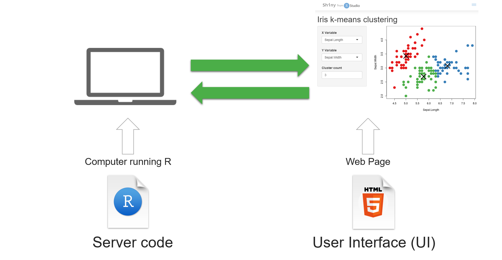
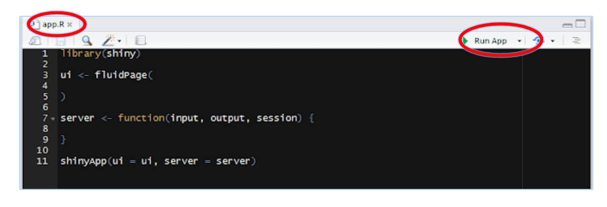
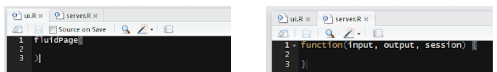
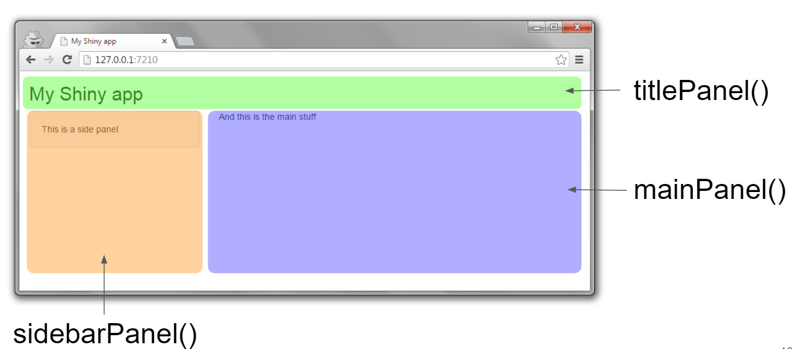
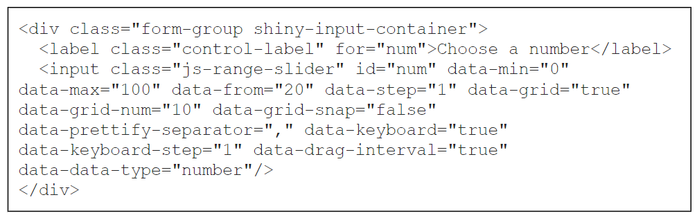
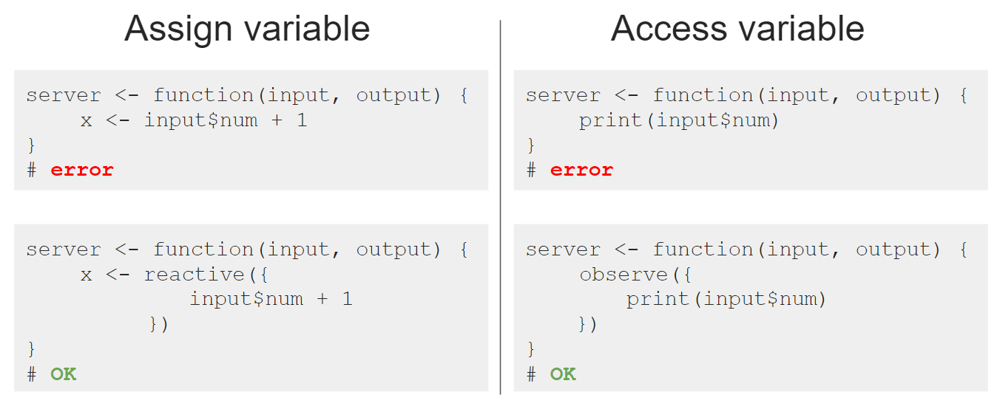

# CEH Environmental Data Science Group

--

- Environmental Infomatics Data Centre

- Speicialist data resources, portals and information products

- Software development

- National capability

- DataLab initiative and the data science framework

- Close collaboration with LU (e.g. LEC, DSI, DSNE) and other partners

- My role


---
class: middle

layout: true
background-image: url(img/shiny_logo.png)
background-position: 1% 99%
background-size: 10%
---

# What is `shiny`?

--

- R package from RStudio
> .fancy["A simple, in-browser, markdown-driven slideshow tool targeted at people who know their way around HTML and CSS"]

- Web application framework for R

- R code → interactive web page

- No HTML/CSS/JavaScript knowledge required

- Great for sharing R analysis with someone scared of R (and others)


---

# Why sharing your work interactively using web apps/dashboards?

--

- Let the user explore the datset themselves (Guided tour)


- Let the user try out your methods (e.g. using their own dataset)


- Illustrate impact and engage stakeholders


- Python equivalent? [Dash by plotly](https://plot.ly/dash/)


---

# Today's goal:

???

Awkwardly, this seems to work! (to hide or exclude sldie "exclude: true")

--

- Showcase a few R shiny apps (a flavour of what they can do)

- Basic R shiny app concepts

- Key resources and related R packages

- A guide to make your first shiny app

- Q&A


---
class:  top, center, middle
background-image: url("https://shiny.rstudio.com/gallery/images/screenshots/movie-explorer.png")
background-size: contained
background-position: center;
---
class:  top, center, middle
background-image: url("https://shiny.rstudio.com/gallery/images/screenshots/retirement-simulation.png")
background-size: contained
background-position: center;
---
class:  top, center, middle
background-image: url("https://shiny.rstudio.com/gallery/images/screenshots/superzip-example.png")
background-size: contained
background-position: center;
---
# [Changepoint analysis](https://datalab-changepoint.datalabs.ceh.ac.uk/)
# for the UK National River Flow Archive (NRFA)

---
# [Nature's postcodes:](https://shiny-apps.ceh.ac.uk/natures_postcode/)
# Which neigborhood is doing best in this species recording citizen science project?
---
exclude: true
# [Soil hydraulic properties map](https://datalab-testmyenvr.datalabs.ceh.ac.uk/)
# of the United Kingdom
---

layout: false
class:  center, middle


# **Crucial `shiny` concepts**

(1) UI + server, (2) reactivity

---
class: middle
layout: true
background-image: url(img/shiny_logo.png)
background-position: 1% 99%
background-size: 10%
---


# What's in a `shiny` app?

.shrink[
.right[] ]

- plus optional web elements (e.g. static images, css files)

---
# Two ways to run a `shiny` app

- single file option
.shrink[
.shrink[
.right[] ]]

- two file option - save UI as "ui.R" and server as "server.R" in the same directory
.shrink[
.shrink[
.right[] ]]

---
# Making your `shiny` app available

- Run it locally

- Serve it on http://www.shinyapps.io/

- Use other servers: Amazon Cloud, your institution etc.

---
# UI components

- inputs (e.g. buttons, sliders, checkboxes, file upload box) ...`input$*`

- outputs (e.g. plots, tables)

- layouts (how do you want everything to be arranged) and HTML

- check out the package `shinythemes`

.shrink[
.right[] ]

---
# UI components

- everything is turned into HTML + JavaScript for you (it's just a webpage)

```{r eval=FALSE}
sliderInput("num","Choose a number", min = 0, max=100, value = 20)
```

.shrink[
.right[] ]

---
# Server components 

- your analysis (does it react to user input?) 

- If so, use `reactive` (assign), `observe` (access), `isoluate`

- output components...`output$*`, use `render*( {} )`

---
# Reactivity

- Shiny uses reactive programming and supports reactive variables

- Unlike regular R, if `x` changes, anything that relies of `x` is re-evaluated.

.shrink[
.right[] ]
---

layout: false
class:  center, middle

# **Run your first `shiny` code**

"Learning is doing."
---
class: middle
layout: true
background-image: url(img/shiny_logo.png)
background-position: 1% 99%
background-size: 10%


---
# Run your first `shiny` code
```{r eval=FALSE}
shinyAppDir(
  system.file("examples/06_tabsets", package="shiny"),
  options = list(width = "100%", height = 700)
)
```
View the code: 
```{css, echo=FALSE}
pre {
  max-height: 300px;
  overflow-y: auto;
}

pre[class] {
  max-height: 100px;
}
```
```{r eval=FALSE, fig.height=2}
# file.show(system.file("examples/06_tabsets/app.R", package="shiny"))
# https://dr-harper.github.io/rmarkdown-cookbook/html-scroll.html

library(shiny)

# Define UI for random distribution app ----
ui <- fluidPage(

  # App title ----
  titlePanel("Tabsets"),

  # Sidebar layout with input and output definitions ----
  sidebarLayout(

    # Sidebar panel for inputs ----
    sidebarPanel(

      # Input: Select the random distribution type ----
      radioButtons("dist", "Distribution type:",
                   c("Normal" = "norm",
                     "Uniform" = "unif",
                     "Log-normal" = "lnorm",
                     "Exponential" = "exp")),

      # br() element to introduce extra vertical spacing ----
      br(),

      # Input: Slider for the number of observations to generate ----
      sliderInput("n",
                  "Number of observations:",
                  value = 500,
                  min = 1,
                  max = 1000)

    ),

    # Main panel for displaying outputs ----
    mainPanel(

      # Output: Tabset w/ plot, summary, and table ----
      tabsetPanel(type = "tabs",
                  tabPanel("Plot", plotOutput("plot")),
                  tabPanel("Summary", verbatimTextOutput("summary")),
                  tabPanel("Table", tableOutput("table"))
      )

    )
  )
)

# Define server logic for random distribution app ----
server <- function(input, output) {

  # Reactive expression to generate the requested distribution ----
  # This is called whenever the inputs change. The output functions
  # defined below then use the value computed from this expression
  d <- reactive({
    dist <- switch(input$dist,
                   norm = rnorm,
                   unif = runif,
                   lnorm = rlnorm,
                   exp = rexp,
                   rnorm)

    dist(input$n)
  })

  # Generate a plot of the data ----
  # Also uses the inputs to build the plot label. Note that the
  # dependencies on the inputs and the data reactive expression are
  # both tracked, and all expressions are called in the sequence
  # implied by the dependency graph.
  output$plot <- renderPlot({
    dist <- input$dist
    n <- input$n

    hist(d(),
         main = paste("r", dist, "(", n, ")", sep = ""),
         col = "#75AADB", border = "white")
  })

  # Generate a summary of the data ----
  output$summary <- renderPrint({
    summary(d())
  })

  # Generate an HTML table view of the data ----
  output$table <- renderTable({
    d()
  })

}

# Create Shiny app ----
shinyApp(ui, server)
```

---

layout: false
class:  center, middle

# **Useful R packages to go with R `shiny`**

"Make your app interactive and look pretty!"
---
class: middle
layout: true
background-image: url(img/shiny_logo.png)
background-position: 1% 99%
background-size: 10%
---


# Adding interactive maps using **leaflet**

```{r out.width='100%', fig.height=6, eval=require('leaflet')}
leaflet(data=ECN_site_info) %>% addTiles() %>%addMarkers(~long,~lat,label = paste0("T",ECN_site_info$sitecode,": ",ECN_site_info$name))

```


---
exclude: true

# The **r2d3** package

- Full flexibility to custom build D3 visualizations (on top of what's been available as *htmlwidgets*)

- Not limited to R figure types

- It will take time to write the .js file

.right[]

---

# Presenting tables

If you want to generate a table, make sure it is in the HTML format (instead of Markdown or other formats), e.g.,

```{r}
knitr::kable(head(MEMSS::Theoph), format = 'html')
```

---
# Using the package **DT**


```{r eval=require('DT'), tidy=FALSE}
DT::datatable(
  head(MEMSS::Theoph, 120),
  fillContainer = FALSE, options = list(pageLength = 7)
)
```
---
exclude: true
name: pull-demo

.left-column[
# `plotly` for nice interactive plots

]


.right-column[

- Works for most `ggplot2` functions
- You may try `ggvis` and `googlevis` packages too

```{r eval=require('plotly'), tidy=FALSE, out.width="75%",out.height="75%" }
p = ggplot(data = mtcars, aes(x = disp, y = cyl)) + 
      geom_point() + geom_smooth(method=lm) + ggtitle('cars')
ggplotly(p)
```

]

---
# `plotly` for nice interactive plots

- Works for most `ggplot2` functions
- You may try `ggvis` and `googlevis` packages too

```{r eval=require('plotly'), tidy=FALSE, out.width="60%",out.height="60%" }
p = ggplot(data = mtcars, aes(x = disp, y = cyl)) + 
      geom_point() + geom_smooth(method=lm) + ggtitle('cars')
ggplotly(p)
```

---
# How to design your `shiny` app?

--
Things to think about:

- what is your audience? 

- What data/ data product would you like them to interact with?
--

- what would you like them to change (i.e. inputs)?

- what would you like to show them (i.e. outputs)?
--

- how to fit your analysis behind the scene (i.e. in server.R)

--

- how would you like the different elements appear (e.g. layout)?

---

layout: false
class:  center, middle

# **Useful resources**

Links to ebooks/blogs/doc/repo pages to learn more.


---
class: middle
# Lists of resources

- [STAT545 ebook shiny tutorial](https://stat545.com/shiny-tutorial.html)

- [RStudio shiny cheat sheet](https://shiny.rstudio.com/images/shiny-cheatsheet.pdf)

- [slides by Dean Attali (recommended)](https://docs.google.com/presentation/d/1dXhqqsD7dPOOdcC5Y7RW--dEU7UfU52qlb0YD3kKeLw/edit#slide=id.p)

- [R x Plotly ebook](https://plotly-r.com/introduction.html)

- [blogs by Zev Ross](https://www.zevross.com/blog/)

- RStudio GitHub: 100+ examples

- Stack Overflow

---
exclude: true
class: middle

# Potentially we can do a follow-up session on:
- reactivity / event handling

- app appearance

- debugging and profiling

- leaflet

- advanced topics

- drop-in "clinic"

---
layout: false
class:  center, middle

# **Thanks!**

Slides created via the R package [**xaringan**](https://github.com/yihui/xaringan).

---


# This presentation is made using the R package **xaringan**

- **Free** and Open Source (Slides are composed in R Markdown + css)--> HTML document

- Uses **remark.js** library

- Portable and easily share (Web-based slide) and easily print to PDF from Chrome

- [**Repoducibe**](Reproducibility) research result

- Limited capability to embed shiny apps at the moment

.shrink[
.right[] ]

---
exclude: true

<!-- --- -->

<!-- name: fat -->
<!-- class: inverse, top, center, middle -->
<!-- background-image: url("img/bake-599521_1920-1024x683.jpg") -->
<!-- background-size: cover -->

<!-- --- -->
<!-- template: fat -->

<!-- # FAT -->

<!-- --- -->
<!-- template: fat -->

<!-- # FAT = CHUNKS -->


